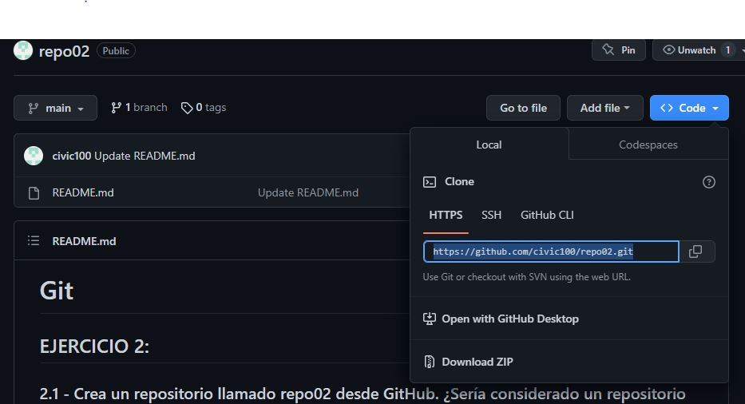
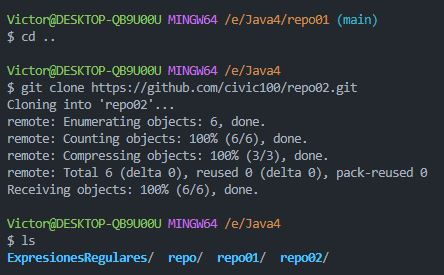

# Git #

## EJERCICIO 2: ##

### 2.1 - Crea un repositorio llamado repo02 desde GitHub. ¿Sería considerado un repositorio local o remoto? ###

Sera considerado un repositorio remoto

### 2.2 – Posteriormente, clónalo (mediante al comando git clone), lo que realizará una copia del repositorio remoto en nuestro equipo, creando con ello un repositorio local a partir del repositorio en remoto ###

Nos dirigimos a la página web [GitHub](https://github.com/ "https://github.com") y en la sección de <>Code copiamos el https

Y mediante el comando git clone "https..." realizamos la copia de remoto en local del repositorio 

### 2-3 - Añade un fichero readme.md y ejecuta los comandos pertinentes hasta llegar a poder realizar un commit. ###

El fichero "readme.md" se ha creado al crear el repositorio.
