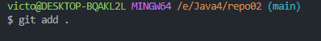
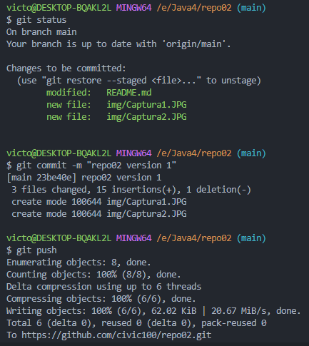

# Git #

## EJERCICIO 2: ##

### 2.1 - Crea un repositorio llamado repo02 desde GitHub. ¿Sería considerado un repositorio local o remoto? ###

Sera considerado un repositorio remoto

### 2.2 – Posteriormente, clónalo (mediante al comando git clone), lo que realizará una copia del repositorio remoto en nuestro equipo, creando con ello un repositorio local a partir del repositorio en remoto ###

Nos dirigimos a la página web [GitHub](https://github.com/ "https://github.com") y en la sección de <>Code copiamos el https

Y mediante el comando git clone "https..." realizamos la copia de remoto en local del repositorio 

### 2-3 - Añade un fichero readme.md y ejecuta los comandos pertinentes hasta llegar a poder realizar un commit. ###

El fichero "readme.md" se ha creado al crear el repositorio.

### 2.4 – Entra en este manual de Markdown y haz un resumen de los principales comandos de Git con los que hemos trabajando. Puedes utilizar tablas, imágenes, títulos, enlaces, etc. ###

## [Manual de Markdown](https://medium.com/@davidbernalgonzalez/3-markdown-c82d88c1d222 "https://github.com")  💻💻 
***

## 1. Configurando Git 

    Para comenzar a utilizar Git, es importante configurar tu nombre de usuario y dirección de correo electrónico. Esto se utiliza en los registros de commits para identificar al autor.

    $ git config user.name "Tu Nombre"
    $ git config user.email "tu@email.com"

***
## 2. Creando un repositorio local
    Puedes iniciar un repositorio local en un directorio existente utilizando el comando git init. Por ejemplo:

    $ git init my_repo
***
## 3. Git status
    El comando git status te proporciona información sobre el estado actual de tu repositorio, como los archivos modificados, los archivos en el área de preparación (staging area) y más.
***
## 4. Añadiendo los ficheros al staging area
    Para preparar archivos para un commit, utiliza git add. Puedes agregar archivos específicos o todos los archivos modificados

    $ git add archivo.txt        # Agregar un archivo específico
    $ git add .                  # Agregar todos los archivos modificados
***
## 5. Retornando un ficheros al working directory
    Si deseas quitar un archivo del área de preparación (staging area), puedes usar el comando git reset.
    $ git reset archivo.txt      # Retornar un archivo específico al working directory
***
## 6. Git commit
    El comando git commit se utiliza para guardar los cambios preparados en el área de preparación en el historial de versiones de Git.

    $ git commit -m "Mensaje de commit descriptivo"
***
## 7. Git log
    Para ver el historial de commits en tu repositorio, puedes usar git log. Esto muestra información sobre los commits, como su autor, fecha y mensaje.
***
## 8. Git push 
    Para enviar tus commits al repositorio remoto, utiliza el comando git push.
***
## 9. Asociando el repositorio remoto con el repositorio local
    Para conectar tu repositorio local con un repositorio remoto, puedes usar git remote. Esto te permite enviar y recibir cambios entre ambos.

    $ git remote -v                # Ver las URL de los repositorios remotos asociados
    $ git remote add origin URL    # Asociar un repositorio remoto (origin) a tu repositorio local
***

## 10. Git pull
    Para obtener los últimos cambios del repositorio remoto y fusionarlos en tu rama local, puedes utilizar $ git pull.

    $ git pull origin main         # Obtener y fusionar cambios desde la rama "main" del repositorio remoto
***
## 11. Git clone
    Si deseas crear una copia completa de un repositorio remoto en tu máquina local, puedes usar git clone. Esto descargará todo el historial y los archivos del repositorio remoto.

    $ git clone URL_del_repositorio

***
¡Ahora tienes una guía básica de Git para comenzar a trabajar con este sistema de control de versiones!
